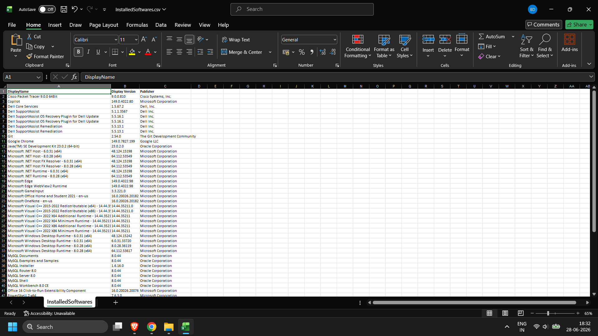
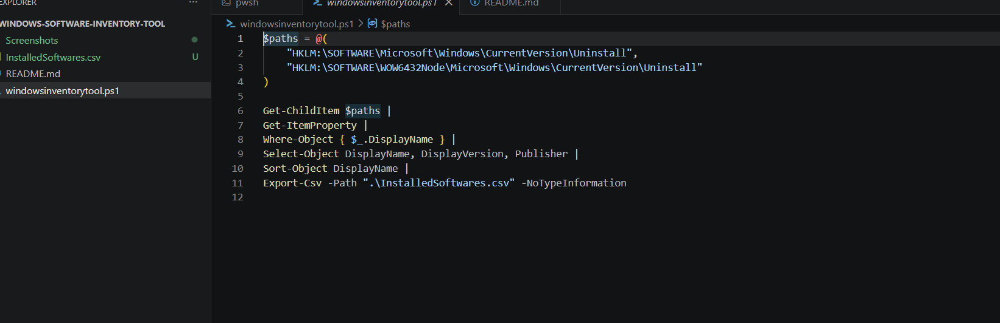

# Windows Software Inventory Tool

## Overview

A PowerShell-based inventory tool that retrieves installed software information from the Windows Registry and exports the results to a CSV report.

## Features

- Reads installed software from Windows Registry
- Supports 32-bit and 64-bit registry locations
- Displays:
  - Software Name
  - Version
  - Publisher
- Sorts applications alphabetically
- Exports inventory to CSV
## Screenshots

### CSV Report

### Source Code

## Technologies Used

- PowerShell
- Windows Registry
- Windows Administration

## Skills Demonstrated

- PowerShell Scripting
- Registry Provider
- Object Pipelines
- Data Filtering
- CSV Export
- Windows Administration

## Future Improvements

- Search installed software
- Export to HTML
- Detect duplicate applications
- Display installation dates
- Compare inventories between systems